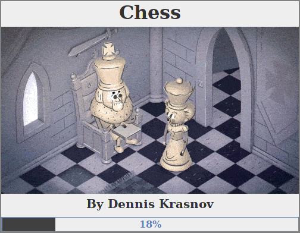
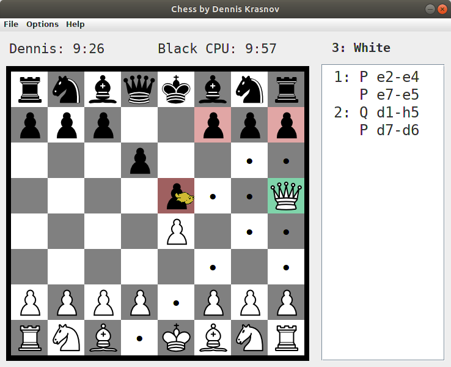
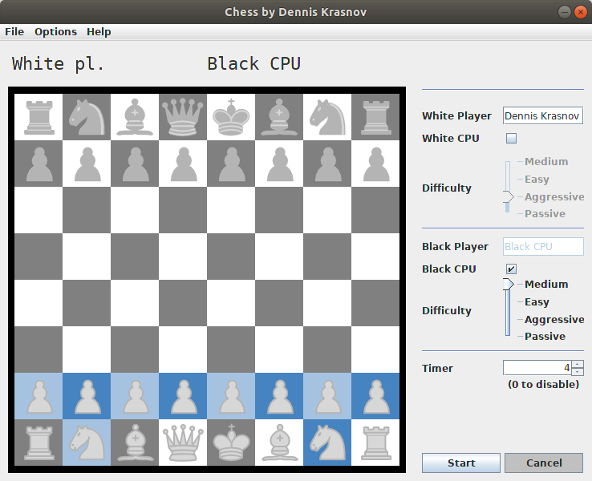
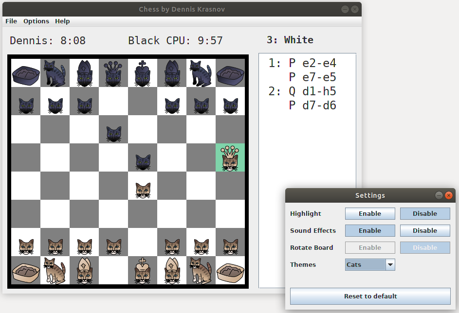
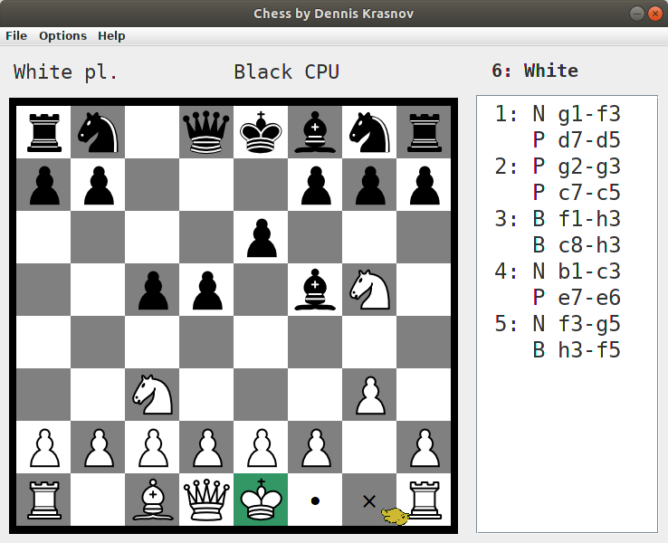

# Chess
The game chess I wrote for a school project when I was in grade 10. Features parallelism, game theory, serializing game state, and more.

### How to run

 ```bash
wget https://github.com/Dennis-Krasnov/Chess/blob/master/DennisKrasnovChess.jar
java -jar DennisKrasnovChess.jar
 ```

### Screenshots

#### Totally useless loading screen :)



#### Highlighting available moves



#### Game AI



#### Customization



#### Advanced moves



